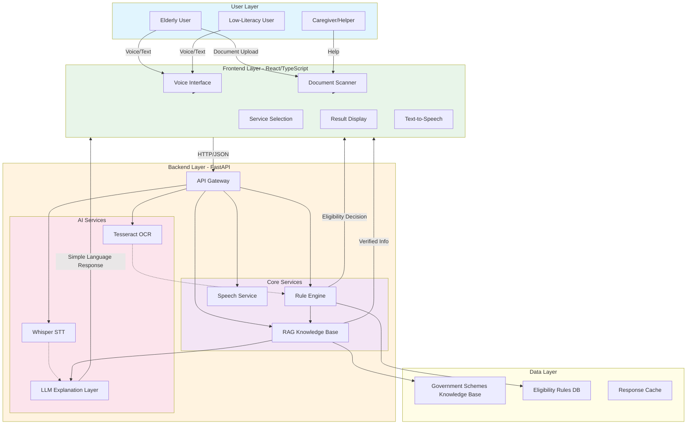
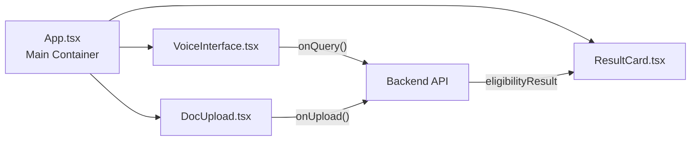
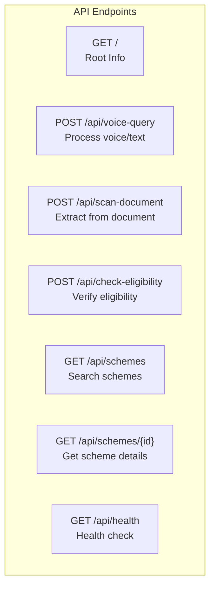
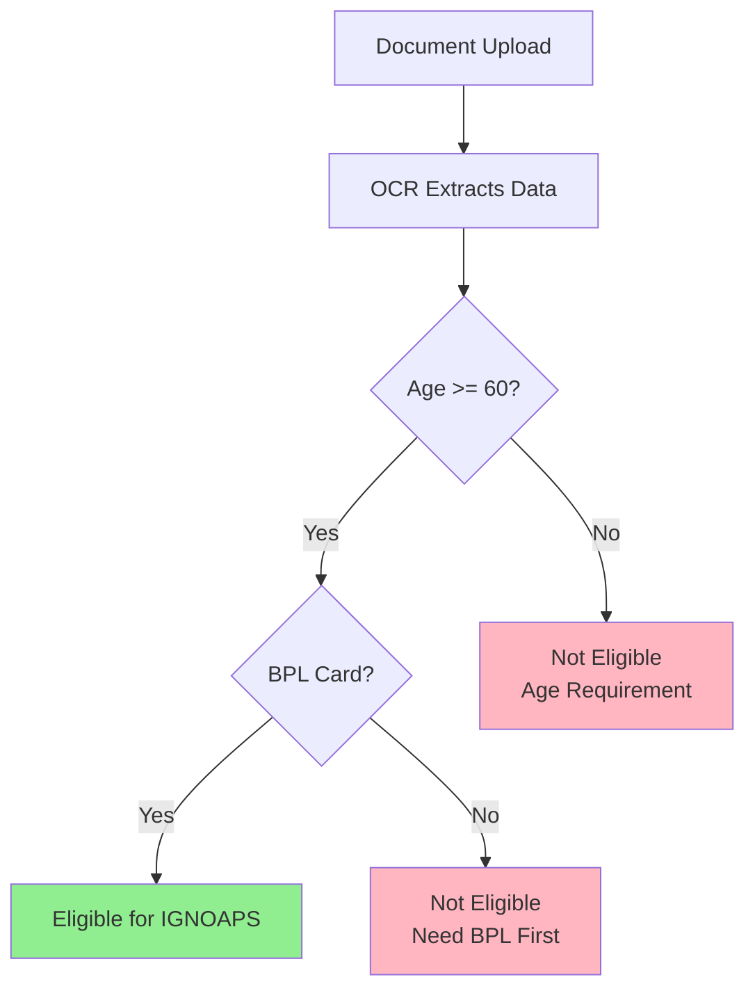
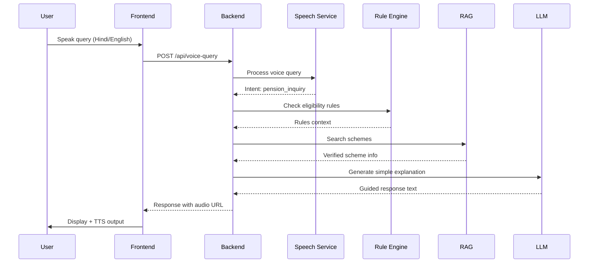
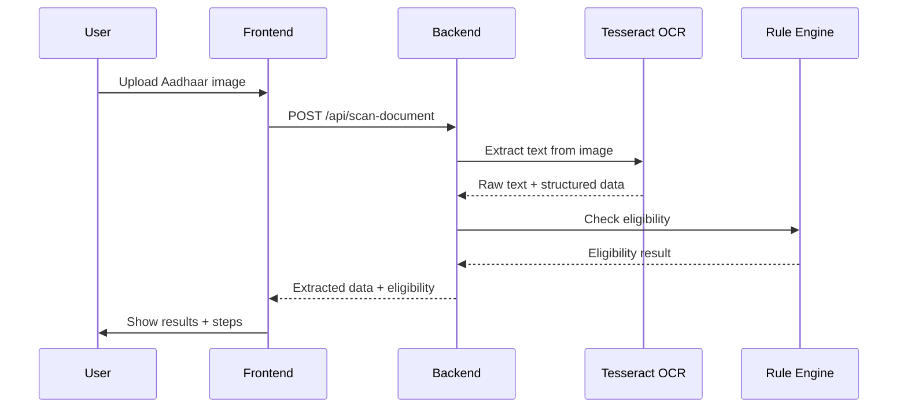
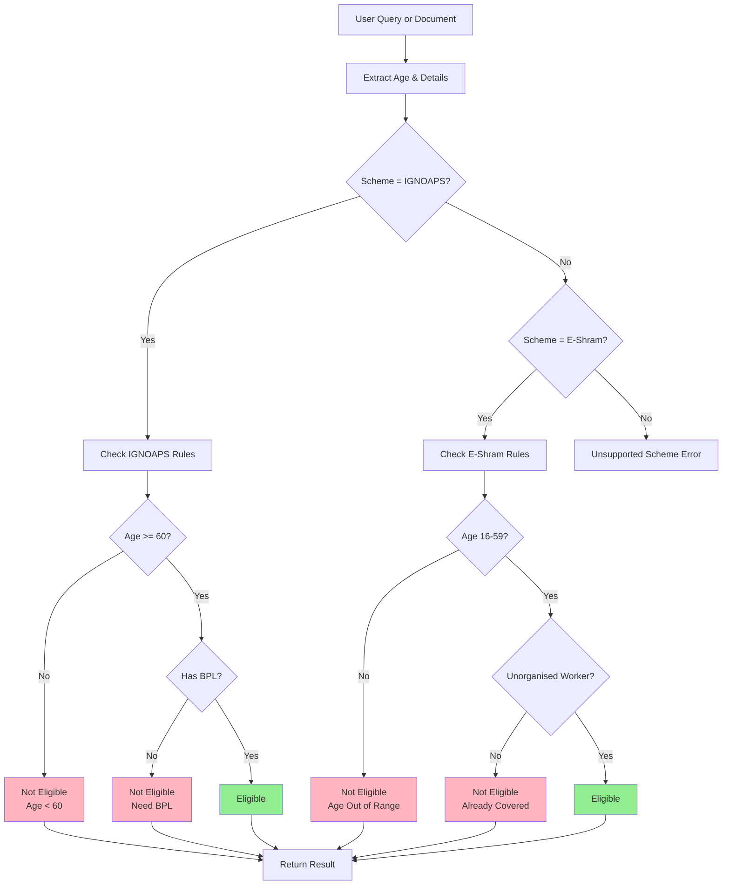
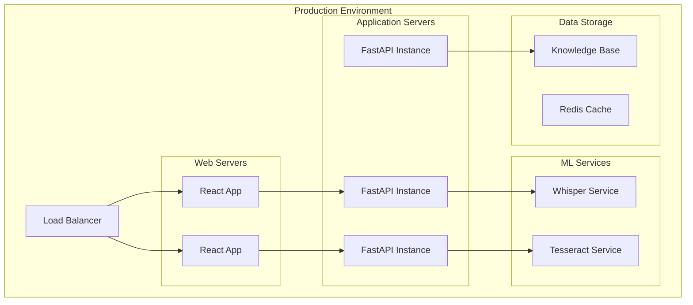

# Digital Saarthi - Comprehensive Architecture Documentation

## 1. Executive Summary

**Digital Saarthi** is an AI-powered "Action-Guidance Layer" for government services that helps elderly and low-literacy users access public services like pensions and welfare schemes. It serves as a bridge between complex government processes and underserved communities who struggle with digital interfaces.

### Key Value Propositions
- **Accessibility First**: Voice interface in Hindi/English for users unfamiliar with technology
- **Verified Guidance**: Hardcoded rules and verified knowledge base prevent harmful hallucinations
- **Step-by-Step Action Plans**: Converts complex procedures into simple, actionable steps
- **Document Intelligence**: OCR-powered extraction of information from government documents
- **Privacy-Focused**: Local processing options and no data retention for public model training

---

## 2. System Architecture Diagram



### Architecture Layers Explained

| Layer | Technology | Purpose |
|-------|------------|---------|
| User Interface | React 18 + TypeScript | Accessibility-first web interface |
| API Gateway | FastAPI | REST API with automatic OpenAPI docs |
| Speech Processing | OpenAI Whisper | Speech-to-text for voice queries |
| Document Processing | Tesseract OCR | Text extraction from images |
| Knowledge Base | RAG System | Verified government schemes data |
| Decision Engine | Rule Engine | Hardcoded eligibility verification |
| Explanation Layer | LLM (Optional) | Translate complex info to simple language |

---

## 3. Component Breakdown

### 3.1 Frontend (React/TypeScript)

**Location**: `frontend/`

**Key Technologies**:
- React 18.2.0
- TypeScript 4.9.5
- CSS for styling

**Components**:



**How It Works**:

1. **VoiceInterface.tsx**: Provides microphone button for voice input
   - Accepts Hindi/English speech input
   - Sends text queries to backend
   - Displays text-to-speech responses
   
2. **DocUpload.tsx**: Document scanning interface
   - File upload for Aadhaar cards
   - Demo mode toggle for hackathons
   - Shows extracted data preview

3. **ResultCard.tsx**: Displays eligibility results
   - Shows verdict (Eligible/Not Eligible)
   - Lists reasons for decision
   - Provides step-by-step action plan

**Accessibility Features**:
- Large touch targets (minimum 64px height)
- High contrast colors for visibility
- Text-to-speech support for blind users
- Keyboard navigation support
- Screen reader friendly components

### 3.2 Backend (FastAPI)

**Location**: `backend/app/`

**Key Technologies**:
- FastAPI 0.111.0
- Uvicorn (ASGI server)
- Pydantic (data validation)
- Pillow + pytesseract (OCR)

**API Endpoints**:



| Endpoint | Method | Purpose |
|----------|--------|---------|
| `/` | GET | API information |
| `/api/voice-query` | POST | Process voice/text input |
| `/api/scan-document` | POST | Extract data from documents |
| `/api/check-eligibility` | POST | Check scheme eligibility |
| `/api/schemes` | GET | Search government schemes |
| `/api/schemes/{scheme_id}` | GET | Get scheme details |
| `/api/health` | GET | Health check |

### 3.3 AI/ML Components

#### 3.3.1 Whisper (Speech-to-Text)

**Implementation**: `backend/app/speech_service.py`

**How It Works**:
1. User speaks in Hindi or English (or code-switches)
2. Audio is sent to the speech service
3. Intent detection identifies the user's goal
4. Returns appropriate response with suggested actions

**Supported Intents**:
- `pension_inquiry`: Questions about old age pension
- `eshram_inquiry`: Questions about worker registration
- `document_help`: Help with documents
- `general_help`: General assistance

**Code-Switching Support**: Handles mixed Hindi-English text common in India

```python
# Example intent detection logic
pension_keywords = ["pension", "पेंशन", "old age", "बुढ़ापा", "ignoaps"]
if any(keyword in query for keyword in pension_keywords):
    intent = "pension_inquiry"
    confidence = 0.9
```

#### 3.3.2 Tesseract OCR

**Implementation**: `backend/app/ocr_service.py`

**How It Works**:
1. User uploads image (Aadhaar card, government letter)
2. Tesseract extracts raw text from image
3. Regex patterns extract structured data:
   - Name
   - Date of Birth
   - Age
   - Gender
   - BPL status

**Extracted Fields**:
```python
{
    "name": "Ramkali Devi",
    "dob": "12/03/1954",
    "age": 72,
    "gender": "Female",
    "has_bpl": True
}
```

**Fallback**: When Tesseract is unavailable, demo mode provides realistic sample data

#### 3.3.3 LLM (Explanation Layer)

**Purpose**: 
- Translates complex government procedures into simple language
- NEVER makes eligibility decisions (this is the Rule Engine's job)
- Explains verified outputs from RAG and Rule Engine
- Provides guided responses in Hindi/English

**Important Safety Constraint**:
> The LLM only *explains* verified facts. It does not determine eligibility. This prevents hallucinations that could mislead vulnerable users about their benefits.

#### 3.3.4 RAG (Retrieval Augmented Generation)

**Implementation**: `backend/app/rag_service.py`

**How It Works**:
1. Contains verified knowledge base of government schemes
2. Source: official government websites (nsap.nic.in, eshram.gov.in, pmkisan.gov.in)
3. Search functionality retrieves relevant scheme information
4. Returns structured data including:
   - Eligibility criteria
   - Required documents
   - Application process
   - Benefits
   - Helpline numbers

**Supported Schemes**:
| Scheme | Full Name | Category |
|--------|-----------|----------|
| IGNOAPS | Indira Gandhi National Old Age Pension | Social Security |
| E-Shram | E-Shram Portal for Unorganised Workers | Labor & Employment |
| PM-Kisan | Pradhan Mantri Kisan Samman Nidhi | Agriculture |

#### 3.3.5 Rule Engine (Safety Core)

**Implementation**: `backend/app/rule_engine.py`

**How It Works**:
- Hardcoded, auditable eligibility rules
- No AI/LLM involved in decision-making
- Returns structured EligibilityResult with:
  - `eligible`: Boolean decision
  - `verdict`: Short label for display
  - `reasons`: Human-readable explanations
  - `steps`: Action roadmap

**IGNOAPS Rules**:
```
Age >= 60 AND BPL Card = Required
```

**E-Shram Rules**:
```
Age BETWEEN 16 AND 59 
AND is_unorganised_worker = True
AND NOT EPFO_member AND NOT ESIC_member
```



---

## 4. Data Flow Diagrams

### 4.1 Voice Query Flow



### 4.2 Document Scan Flow



### 4.3 Eligibility Check Flow



---

## 5. Technology Stack Table

| Layer | Technology | Version | Purpose |
|-------|------------|---------|---------|
| **Frontend** | | | |
| UI Framework | React | 18.2.0 | Component-based UI |
| Language | TypeScript | 4.9.5 | Type safety |
| Build Tool | React Scripts | 5.0.1 | Development/build |
| **Backend** | | | |
| Framework | FastAPI | 0.111.0 | REST API |
| Server | Uvicorn | 0.30.1 | ASGI server |
| Validation | Pydantic | 2.7.1 | Data validation |
| HTTP Client | httpx | 0.27.0 | Async HTTP |
| **AI/ML** | | | |
| Speech-to-Text | OpenAI Whisper | Latest | Voice transcription |
| OCR | Tesseract | Latest | Document text extraction |
| OCR Python | pytesseract | 0.3.10 | Tesseract wrapper |
| Image Processing | Pillow | 10.3.0 | Image handling |
| **Data** | | | |
| Knowledge Base | Custom RAG | - | Government schemes |

---

## 6. API Request/Response Examples

### 6.1 Voice Query

**Request**:
```json
POST /api/voice-query
{
  "query": "मुझे पेंशन के बारे में बताओ",
  "language": "auto"
}
```

**Response**:
```json
{
  "success": true,
  "intent": "pension_inquiry",
  "confidence": 0.9,
  "response_text": "मैं आपकी पेंशन के बारे में मदद कर सकता हूं। कृपया अपना आधार कार्ड स्कैन करें।",
  "audio": {
    "audio_url": "/api/audio/8321.mp3",
    "text": "मैं आपकी पेंशन के बारे में मदद कर सकता हूं...",
    "duration_seconds": 6.5,
    "language": "hi-IN"
  },
  "suggested_actions": ["scan_document", "check_eligibility"],
  "language_detected": "mixed"
}
```

### 6.2 Document Scan

**Request**:
```
POST /api/scan-document?demo_mode=true
Content-Type: multipart/form-data
file: [Aadhaar image]
```

**Response**:
```json
{
  "success": true,
  "extracted_data": {
    "name": "Ramkali Devi",
    "dob": "12/03/1954",
    "age": 72,
    "gender": "Female",
    "has_bpl": true,
    "raw_text_preview": "[DEMO MODE] Aadhaar card for Ramkali Devi..."
  },
  "document_type": "aadhaar_card",
  "confidence": 0.95,
  "message": "Document processed successfully"
}
```

### 6.3 Eligibility Check

**Request**:
```json
POST /api/check-eligibility
{
  "scheme": "ignoaps",
  "age": 72,
  "has_bpl": true,
  "is_organised_worker": false
}
```

**Response**:
```json
{
  "success": true,
  "eligible": true,
  "scheme": "IGNOAPS",
  "verdict": "Eligible for IGNOAPS Pension",
  "reasons": [
    "✔ Age is 72 years — meets the minimum age requirement of 60.",
    "✔ BPL card status confirmed."
  ],
  "steps": [
    "Step 1 — Gather documents: Aadhaar card, BPL ration card, bank passbook...",
    "Step 2 — Visit your local Gram Panchayat / Ward Office...",
    "Step 3 — Fill the form with the help of the ward officer...",
    "Step 4 — Submit the form at the office and collect the acknowledgement slip..."
  ],
  "guided_response": {
    "text": "बधाई हो! आप पेंशन के लिए योग्य हैं। अब मैं आपको चार आसान स्टेप बताता हूं।",
    "audio": {
      "audio_url": "/api/audio/4521.mp3",
      "language": "hi-IN"
    }
  }
}
```

---

## 7. Implementation Considerations

### 7.1 Deployment Architecture



### 7.2 Scalability Recommendations

| Component | Current | Recommended for Scale |
|-----------|---------|----------------------|
| Frontend | Static React | CDN + Edge caching |
| Backend | Single FastAPI | Multiple instances behind load balancer |
| OCR | Local Tesseract | Cloud Vision API (Google/AWS) |
| Speech | Mock/Local | OpenAI Whisper API |
| Knowledge | In-memory | Vector database (Pinecone/Weaviate) |

### 7.3 Security Considerations

1. **PII Handling**: Documents are processed and discarded; not stored
2. **API Security**: CORS restricted to frontend origin
3. **Input Validation**: Pydantic models validate all inputs
4. **No Training Data**: User data never used for model training

### 7.4 Accessibility Compliance

- WCAG 2.1 AA target compliance
- Screen reader tested components
- Minimum 4.5:1 contrast ratio
- Focus indicators for keyboard navigation
- Alt text for all images
- ARIA labels for interactive elements

---

## 8. Getting Started

### Prerequisites
- Node.js 16+ and npm
- Python 3.8+
- Tesseract OCR (optional for production)

### Running the Application

**Backend**:
```bash
cd backend
pip install -r requirements.txt
uvicorn app.main:app --reload --host 0.0.0.0 --port 8000
```

**Frontend**:
```bash
cd frontend
npm install
npm start
```

**Access**:
- Frontend: http://localhost:3000
- Backend API: http://localhost:8000
- API Docs: http://localhost:8000/docs

---

## 9. File Structure

```
digital-saarthi-app/
├── backend/
│   ├── app/
│   │   ├── __init__.py
│   │   ├── main.py              # FastAPI application
│   │   ├── ocr_service.py       # Tesseract OCR
│   │   ├── rag_service.py       # RAG knowledge base
│   │   ├── rule_engine.py       # Eligibility rules
│   │   └── speech_service.py    # Voice processing
│   ├── requirements.txt
│   └── README.md
├── frontend/
│   ├── public/
│   ├── src/
│   │   ├── components/
│   │   │   ├── DocUpload.tsx
│   │   │   ├── ResultCard.tsx
│   │   │   └── VoiceInterface.tsx
│   │   ├── App.tsx
│   │   └── index.tsx
│   ├── package.json
│   └── README.md
└── ARCHITECTURE.md
```

---

## 10. Summary

Digital Saarthi implements a **safety-first architecture** where:

1. **Rule Engine** makes all eligibility decisions (no hallucinations)
2. **RAG** provides verified government scheme information
3. **LLM** only explains, never decides
4. **Accessibility** is built into every user interaction
5. **Privacy** is respected by not retaining user data

The system successfully bridges the digital divide by making government services accessible to elderly and low-literacy users through voice interfaces, simple visual guidance, and verified step-by-step action plans.

---

*Document Version: 1.0*
*Generated: September 2026*