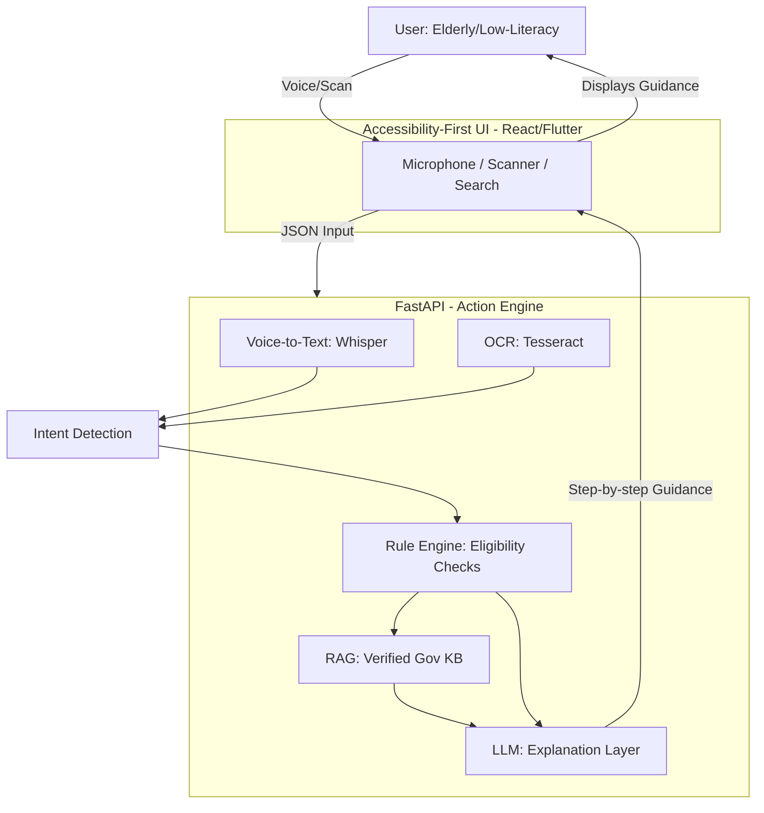

# Digital Saarthi: Project Blueprint

## 1. Executive Summary

**Digital Saarthi** is an AI-powered "Action-Guidance Layer" for government services. It does not replace platforms like UMANG or DigiLocker; instead, it bridges the literacy gap by converting complex government messaging and documents into verified, step-by-step guidance for underserved communities.

---

## 2. System Architecture

### Component Details

*   **Frontend (React/Flutter):** Designed for extreme simplicity. Focus on large buttons, voice input, and clear visual indicators.
*   **Whisper (Speech-to-Text):** Handles local language input and noisy environments.
*   **Tesseract (OCR):** Extracts text from government documents (e.g., Aadhar, pension letters).
*   **Rule Engine:** The "Safety Core." Encodes verified eligibility rules (e.g., "Must be >60, have BPL card").
*   **RAG (Retrieval Augmented Generation):** A knowledge base of government schemes and procedures. **Crucial:** LLM only *explains* verified facts retrieved from here.
*   **LLM (Explanation Layer):** Translates complex procedures into simple, natural language guidance. It never makes decisions; it only explains the verified output of the Rule Engine and RAG.

---

## 3. Deep Interrogation Transcript

### Cycle 1 & 2 (Summary)
The concept was stress-tested against novelty, feasibility, safety, and competition. The focus shifted from a "generic AI assistant" to a "Verified Action-Guidance Layer" for one specific, high-confusion government service workflow.

### Cycle 3: Trust, Safety, and UX
**Q8: Can a user trust an AI with PII/Documents?**
**A:** This is a major trust barrier. If the user feels unsafe, they won't use it. **DO:** Implement local-first processing, clear privacy manifestos, and "delete my data" features. **DON'T:** Use their documents to train public LLM models.

**Q9: How to position "Scam Detection"?**
**A:** Position as an "Assistant Safety Net". Don't say "I will catch all scams." Say "I can flag high-risk patterns like unverified links or urgent OTP requests." This manages expectations while adding massive value.

**DETRIMENT 3: User Distrust**
The system feels like a surveillance tool or a phishing trap. **DO:** Emphasize privacy, transparency, and local processing where possible.

### Cycle 4: Strategic Positioning
**Q10: Is this a winner or a loser?**
**A:**
*   **Winner if:** It presents itself as a **“Verified Action-Guidance Layer”** that fills the cognitive gap, respects PII, acknowledges its own limits, and has a rock-solid, hardcoded demo.
*   **Loser if:** It presents itself as **“The AI for all Government Services”** (competing with UMANG), hallucinates eligibility answers, tries to build every feature, or fails the PII/privacy test.

### Final Conclusion & Note
**The Digital Saarthi concept is highly viable for a hackathon, provided it is aggressively re-positioned from a "Service Aggregator" to a "Verified Guidance Layer."**

*   **The Killer Pitch:** Do not pitch an "AI assistant for government services" (that competes with existing, massive platforms like UMANG). Pitch an **"AI-powered action translator and digital safety net"** for those who are currently overwhelmed and excluded by digital complexity.
*   **The MVP Strategy:** Your 24-hour success depends entirely on **demo reliability**. Do not build a general assistant. Build a **"Verification & Guidance" agent** for ONE specific, high-confusion government service workflow.
*   **The Secret Sauce:** Judges are looking for **engineered safety**. The most impressive technical feat won't be the LLM; it will be the **Rule Engine + Verified Knowledge Base + Fallback to human/official-portal** architecture that prevents hallucination.
*   **The "Hackathon Reality Check":** If you try to make it work for *any* government document or *any* government service, you will likely fail the demo due to scope creep or API instability. Focus on **one** journey, and perfect the UI/UX for the elderly/digitally-excluded user persona.

---

## 4. Final Recommendation
Adopt the "Verified Guidance Layer" positioning, hardcode the knowledge base for your 24-hour demo scenario, and focus entirely on making that single user journey feel safe, reliable, and genuinely transformative for the target persona.
